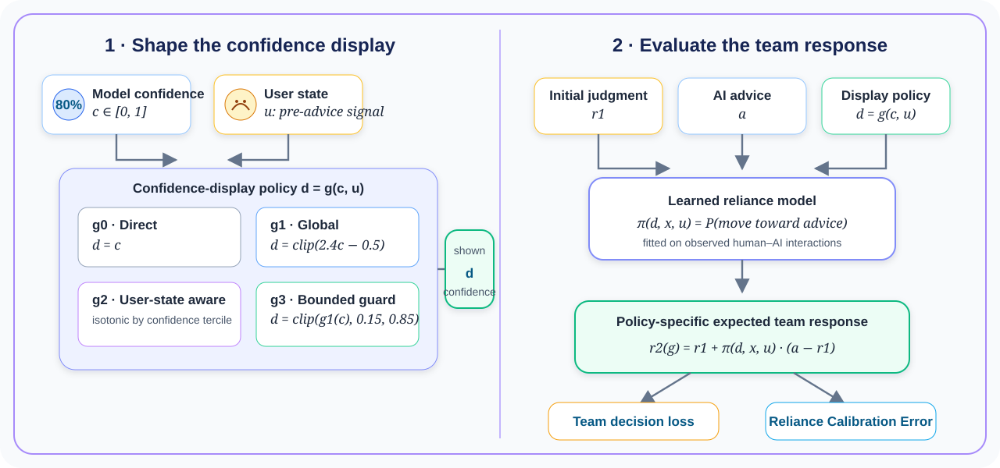
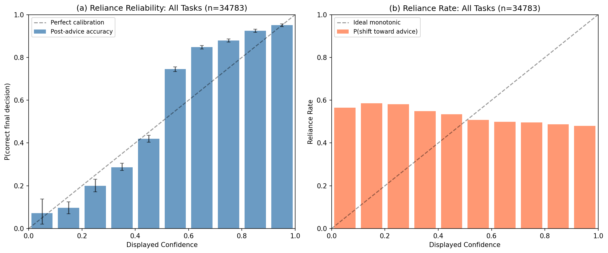
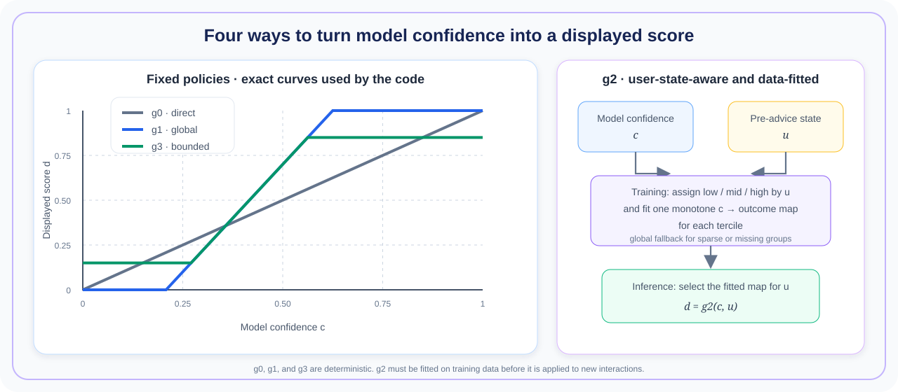
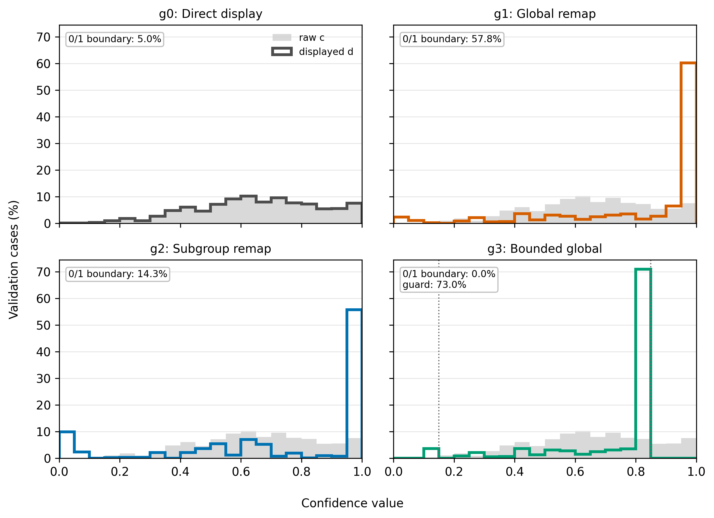

<p align="center">
  
</p>

<h1 align="center">From Calibrated Confidence to Calibrated Reliance</h1>

<p align="center">
  <strong>Human-Aware Confidence Communication for AI-Assisted Decision Making</strong>
</p>

<p align="center">
  <a href="https://github.com/OliverDOU776/From-Calibrated-Confidence-to-Calibrated-Reliance/actions/workflows/tests.yml"></a>
  
  <a href="LICENSE"></a>
  
  
</p>

> **Accepted for publication in ACM Transactions on Social Computing (TSC).**

Most calibration work asks whether a model is correct 80% of the time when it reports 80%
confidence. We ask a different question: **after a person sees that confidence and makes the final
decision, is the human-AI team correct 80% of the time?**

This repository provides the accepted paper's CPU-only offline analysis, the implementation of
**Reliance Calibration Error (RCE)**, the `g0`-`g3` confidence-display policies, deterministic data
setup, compact reference outputs, and numerical regression checks.

## Quick start: use the policies

Install the package from a local clone; using the policy and metric APIs does **not** require the
HAIID dataset.

```bash
git clone https://github.com/OliverDOU776/From-Calibrated-Confidence-to-Calibrated-Reliance.git
cd From-Calibrated-Confidence-to-Calibrated-Reliance
python3 -m venv .venv
source .venv/bin/activate
python -m pip install -e .
```

Apply the three fixed display policies and compute RCE on your own logged team outcomes:

```python
import numpy as np

from calibrated_reliance import bounded_g1, g0, g1, g3, rce

confidence = np.array([0.35, 0.55, 0.80])
final_team_correct = np.array([0, 1, 1])

displayed = {
    "g0_direct": g0(confidence),
    "g1_global": g1(confidence),
    "g3_bounded": g3(confidence),
    "g1_max_shift_10pct": bounded_g1(confidence, delta=0.10),
}

for name, values in displayed.items():
    print(name, values, "RCE =", rce(values, final_team_correct))
```

Fit `g2` on training interactions, then apply it to held-out or future interactions. The three
aligned training arrays are model confidence, pre-advice self-confidence, and final team
correctness:

```python
from calibrated_reliance import apply_g2, fit_g2

g2_policy = fit_g2(
    confidence_train,
    self_confidence_train,
    final_team_correct_train,
)
display_g2 = apply_g2(g2_policy, confidence_test, self_confidence_test)
```

To compare a display under the paper's fitted human-reliance model, use prepared HAIID-format
training and test frames:

```python
from calibrated_reliance import evaluate_policy, fit_reliance_model, g3

reliance_model = fit_reliance_model(train)
display_g3 = g3(test["advice_prob"])
evaluation = evaluate_policy(reliance_model, test, display_g3)

print(evaluation.mse, evaluation.rce, evaluation.mean_reliance)
```

Here `evaluation.rce` is a model-predicted off-policy diagnostic. For observed team outcomes, use
`rce(displayed, final_team_correct)` directly. The expected columns and estimands are documented in
[docs/METHOD.md](docs/METHOD.md).

> **Before deployment:** `g1`, `g2`, and `g3` encode estimates and safeguards from the paper; they
> are not universal calibration maps. Refit or validate a policy on your population, preserve a
> held-out evaluation set, and retain a direct-display fallback.

## What you can do with this repository

- **Audit your own human-AI logs:** call `rce(displayed, final_team_correct)` to quantify whether a
  shown score matches final team correctness.
- **Prototype a display layer:** call `g0`, `g1`, `g3`, or `bounded_g1` without modifying or
  retraining the underlying predictor.
- **Learn a user-state-aware map:** use `fit_g2` on training interactions and `apply_g2` on new
  interactions; sparse or missing self-confidence groups use the global fallback.
- **Compare candidate displays offline:** fit the baseline reliance model once, then call
  `evaluate_policy` for each candidate display vector.
- **Reproduce and inspect the paper:** regenerate the accepted analysis tables from pinned public
  data and verify them numerically against the checked-in reference outputs.

## Why calibrated confidence is not enough

A statistically calibrated model can still induce poorly calibrated human reliance. People combine
AI advice with their own beliefs, confidence, and task context; the displayed number is therefore
filtered through human judgment before it affects the final decision.

We formalize **calibrated reliance** as a team-level property. For a display policy `g`, the shown
confidence is calibrated when

$$
\Pr(\text{final human-AI decision is correct} \mid D_g=d)=d.
$$

RCE summarizes deviations from that ideal:

$$
\operatorname{RCE}(g)=\mathbb{E}\left[\left|\eta_g(D_g)-D_g\right|\right].
$$

The distinction matters empirically: in the primary HAIID condition, conventional model ECE is
`0.018`, while direct-display plug-in RCE is `0.114`.

<p align="center">
  
</p>

## The confidence-display policies

<p align="center">
  
</p>

| Policy | Definition | Interpretation |
|---|---|---|
| `g0` | `d = c` | Directly display the model confidence. |
| `g1` | `d = clip(2.4c - 0.5, 0, 1)` | Global human-aware diagnostic mapping. It is intentionally treated as unconstrained, not automatically deployment-ready. |
| `g2` | Isotonic mapping fitted within pre-advice self-confidence terciles | Captures user-state heterogeneity. It requires reliable elicitation, governance checks, and a safe fallback. |
| `g3` | `d = clip(g1(c), 0.15, 0.85)` | Bounded global mapping that avoids 0/1 displays. |

`g2` is **not** presented as a fairness guarantee. If self-confidence is missing, noisy, correlated
with protected attributes, or strategically reported, the system should fall back to `g0` or a
bounded population-level policy.

See [docs/METHOD.md](docs/METHOD.md) for equations, estimands, and implementation details.

## Key findings

The accepted paper deliberately distinguishes a held-out display-alignment diagnostic from
model-dependent off-policy simulations.

| Policy | Model-predicted MSE ↓ | Plug-in observed-outcome RCE ↓ | Model-predicted RCE ↓ | Displays at 0 or 1 |
|---|---:|---:|---:|---:|
| `g0` direct | 0.571 | 0.114 | **0.040** | 5.0% |
| `g1` global | **0.518** | 0.104 | 0.162 | 57.8% |
| `g2` subgroup-aware | 0.623 | **0.009** | 0.125 | 14.3% |
| `g3` bounded global | 0.530 | 0.047 | 0.070 | **0.0%** |

> **Metric note.** Plug-in observed-outcome RCE keeps held-out team outcomes fixed and evaluates
> numerical display-outcome alignment. Model-predicted MSE and counterfactual RCE re-simulate
> outcomes under a fitted reliance model. They are off-policy estimates, not randomized causal
> effects.

Three patterns are especially important:

1. `g1` produces the lowest simulated MSE, but 57.8% of its displays lie at 0 or 1. It is best read
   as a diagnostic estimate of the correction required under the fitted model.
2. `g2` produces the strongest plug-in RCE alignment, but its model-predicted MSE and RCE are worse
   than direct display. It exposes heterogeneity; it does not justify immediate personalized
   deployment.
3. `g3` preserves much of the simulated MSE gain while eliminating 0/1 displays, making bounded
   policies the more defensible design direction.

The verified release replaces legacy task/subgroup plots from earlier analysis specifications with
the canonical numeric
[`task/user-state sensitivity table`](results/reference/tables/tab_revision_task_user_state_sensitivity.csv).
It uses the same final cohort, split, and reliance model as the main policy comparison and can be
regenerated without any plotting scripts.

## Reproduce the accepted-paper analysis

### 1. Create the environment

```bash
git clone https://github.com/OliverDOU776/From-Calibrated-Confidence-to-Calibrated-Reliance.git
cd From-Calibrated-Confidence-to-Calibrated-Reliance

python3 -m venv .venv
source .venv/bin/activate
python -m pip install --upgrade pip
python -m pip install -e .
```

Python 3.10+ is supported. The accepted-paper offline pipeline is CPU-only; it does not require a
GPU, an API key, or a language-model checkpoint.

For the exact dependency versions used in the release verification run (Python 3.12.3):

```bash
python -m pip install -r requirements-lock.txt
python -m pip install -e . --no-deps
```

The lock file requires Python 3.11 or newer. On Python 3.10, use the compatible dependency
resolution from `python -m pip install -e .`; that path is covered by the test matrix.

### 2. Download and verify HAIID

```bash
python scripts/download_data.py
```

The downloader is pinned to upstream commit `24881cc7586180a9c9742a7dd838aea97d008235` and
fails if either SHA-256 checksum differs. Raw data remain Git-ignored. See
[data/README.md](data/README.md) for provenance and licensing.

### 3. Run the core analysis

```bash
python scripts/reproduce.py --profile core
python scripts/verify_results.py --profile core
```

Generated files are written to `results/generated/`. Reference outputs are never overwritten.

### 4. Run the full diagnostic matrix

```bash
python scripts/reproduce.py --profile full
python scripts/verify_results.py --profile full
```

The full profile additionally fits the alternative reliance-model specifications and runs random,
participant-disjoint, and item-disjoint split sensitivity analyses.

Equivalent shortcuts are available:

```bash
make data
make reproduce       # core
make verify
make reproduce-full  # full diagnostic matrix
make test            # data-free unit tests
```

## What is reproduced

| Scope | Public command | Status |
|---|---|---|
| HAIID preprocessing and accepted 70/30 task-stratified split | `scripts/reproduce.py` | Reproduced from pinned public data |
| `g0`-`g3`, model-predicted MSE/RCE, plug-in RCE | `scripts/reproduce.py` | Reproduced |
| Canonical task- and user-state sensitivity for `g1` versus `g0` | `scripts/reproduce.py` | Reproduced as a verified numeric table |
| Support, clipping, and display-shift diagnostics | `scripts/reproduce.py` | Reproduced |
| Binning, jackknife, user-state, subgroup, and bounded-policy checks | `--profile core` | Reproduced |
| Reliance-model and disjoint-split sensitivity | `--profile full` | Reproduced |
| Published GRACE comparison values | `data/external/grace_verbalized_results.csv` | Auditable context only; not a reproduction of the GRACE raw pipeline |
| 20-participant prospective pilot | — | Not claimed: participant-level data are not in the research workspace |

For the complete output-to-claim map and numerical tolerance policy, see
[docs/REPRODUCIBILITY.md](docs/REPRODUCIBILITY.md).

## Repository structure

```text
.
├── src/calibrated_reliance/   # Reusable data, metric, policy, and reliance-model code
├── scripts/
│   ├── download_data.py       # Pinned, checksum-verified HAIID setup
│   ├── reproduce.py           # Accepted-paper offline analysis
│   └── verify_results.py      # Generated-vs-reference numerical checks
├── data/
│   ├── external/              # Small cited aggregate table for GRACE
│   └── raw/                   # Downloaded data; ignored by Git
├── results/
│   ├── reference/             # Compact accepted-paper reference outputs
│   └── generated/             # Local reproduction outputs; ignored by Git
├── docs/                      # Method and reproducibility documentation
├── tests/                     # Data-free unit tests
├── CITATION.cff
├── pyproject.toml
└── Makefile
```

## Evidence boundaries and responsible use

This repository is designed to make the paper inspectable, including its uncomfortable results.

- The HAIID study is observational. Self-confidence moderation is consistent with anchoring, but it
  does not identify anchoring as the unique causal mechanism.
- Off-policy estimates depend on conditional response modeling, overlap, and the absence of major
  unobserved confounding.
- A confidence display can improve simulated decisions while becoming less semantically honest
  about the model's epistemic state. Do not deploy an undisclosed remapping as if it were raw model
  confidence.
- Subgroup-conditioned policies require measurement-quality, privacy, disparate-impact, and gaming
  audits.
- The small prospective pilot in the paper is feasibility evidence, not confirmatory validation.
- Nothing here establishes safety or effectiveness in high-stakes clinical, legal, financial, or
  public-sector deployment.

<p align="center">
  
</p>

## Citation

The DOI and final volume/issue metadata were not available when this repository was prepared. Until
they are assigned, please cite the accepted paper as:

```bibtex
@article{wang2026calibratedreliance,
  title   = {From Calibrated Confidence to Calibrated Reliance:
             Human-Aware Confidence Communication for AI-Assisted Decision Making},
  author  = {Wang, Zijia and Hu, Kejia},
  journal = {ACM Transactions on Social Computing},
  year    = {2026},
  note    = {Accepted for publication}
}
```

GitHub can also read [CITATION.cff](CITATION.cff) directly.

## Data and third-party acknowledgements

HAIID remains governed by its upstream MIT License and citation requirements. GRACE raw files are
not redistributed. See [data/README.md](data/README.md) and
[THIRD_PARTY_NOTICES.md](THIRD_PARTY_NOTICES.md) for exact versions, checksums, sources, and reuse
boundaries.

## License

The original code in this repository is released under the [MIT License](LICENSE). Third-party
datasets and aggregate results remain governed by their own licenses and citation requirements;
the project license does not override those terms.

## Report a reproducibility issue

Reproducibility reports are welcome through GitHub Issues. When reporting a discrepancy, include
your Python version, dependency versions, command, and the relevant generated/reference filenames.
